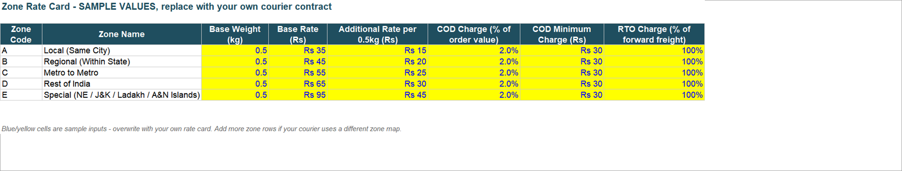
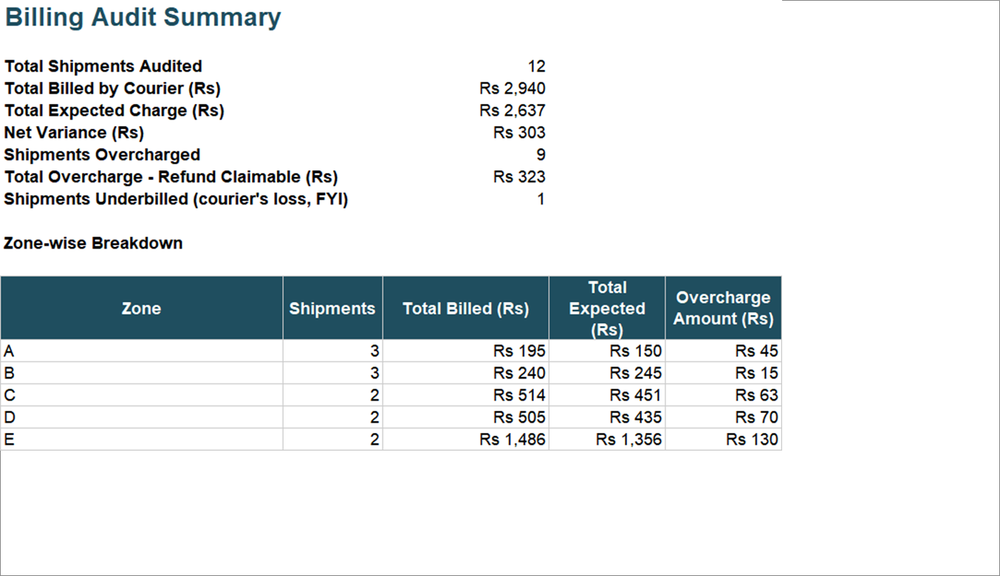
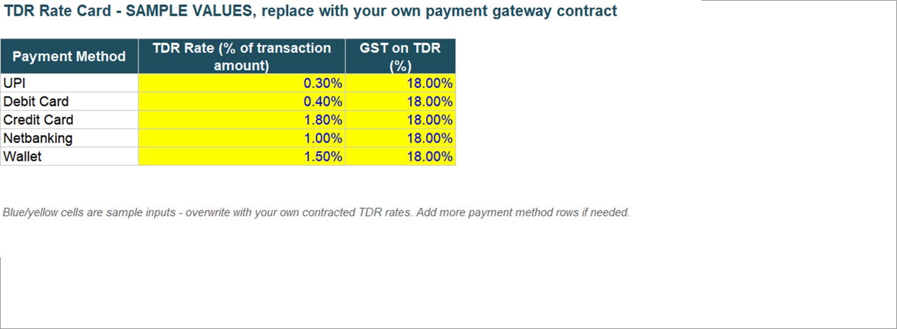
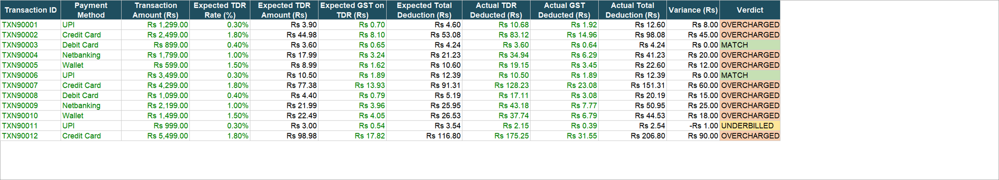
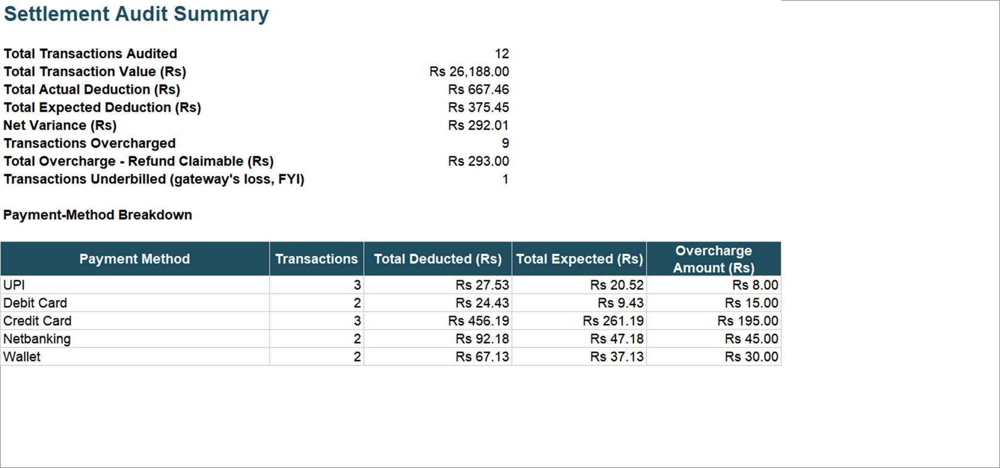

# Excel Automation Templates

Free, no-code Excel/Google Sheets templates for the spreadsheet work that admin, ops, and finance folks
end up doing by hand every month - checking bills, catching overcharges, and making sure the numbers add up.

No coding, no plugins, no sign-ups. Download a template, drop in your own data, and the formulas do the rest.
Each template is also available as a ready-to-import [n8n](https://n8n.io) workflow, if you'd rather
automate the audit than run it in a spreadsheet.

Every template follows the same pattern: a Rate Card/Library tab you customize, a Data tab you paste your
own records into, and an Audit/Fit Checker tab that recalculates automatically and flags what needs
attention.

## Contents

- [1. Courier Billing Audit](#1-courier-billing-audit)
- [2. Payment Gateway TDR Audit](#2-payment-gateway-tdr-audit)
- [3. Volumetric Weight & Box-Fit Checker](#3-volumetric-weight--box-fit-checker)
- [How to use any template](#how-to-use-any-template)
- [Google Sheets compatibility](#google-sheets-compatibility)
- [Why these exist](#why-these-exist)
- [License](#license)

---

## 1. Courier Billing Audit

**The problem:** Couriers bill you per shipment based on zone, weight, and delivery type (prepaid, COD,
RTO). Mistakes - a shipment billed in the wrong zone, weight rounded up to the wrong slab, a COD or RTO
charge applied incorrectly - are common, and reviewing hundreds of shipments by hand isn't realistic. Most
brands just pay the bill without checking.

**What this template does:** You give it your rate card and your shipment data. It calculates what each
shipment *should* have cost, compares it to what the courier actually billed, and flags every mismatch - so
you end up with a ready-made list of overcharges to dispute.

📄 File: [`Courier_Billing_Audit_Template.xlsx`](./courier-billing-audit/Courier_Billing_Audit_Template.xlsx) · Full doc: [courier-billing-audit/README.md](./courier-billing-audit/README.md) · Also available as an [n8n workflow](./courier-billing-audit/n8n-workflow)

### What it looks like

**Rate Card** - your zone rates, ready to overwrite:

**Audit** - every shipment checked, overcharges flagged automatically:

**Summary Dashboard** - your refund claim total, broken down by zone:

### Tabs in the workbook

1. **Read Me** - quick instructions.
2. **Rate Card** - your zone-wise rates (base rate, per-0.5kg rate, COD %, RTO %). Sample values included -
   replace with your actual courier contract.
3. **Shipment Data** - paste your own shipment export here (AWB, zone, weight, dimensions, payment mode,
   status, what the courier billed).
4. **Audit** - calculates volumetric weight, chargeable weight, and the expected charge for every shipment,
   then compares it to the billed amount. Verdict column shows MATCH, OVERCHARGED, or UNDERBILLED.
5. **Summary Dashboard** - total overcharge amount (your refund claim), plus a zone-wise breakdown.

### How the math works

- **Volumetric weight** = (Length x Width x Height in cm) / 5000
- **Chargeable weight** = the higher of actual weight and volumetric weight, rounded up to the nearest 0.5 kg
- **Expected charge** = base freight (by zone) + extra weight charge + COD charge (if applicable) + RTO
  charge (if the shipment was returned)
- **Variance** = what the courier billed minus what you expected to be billed. Positive = you were
  overcharged.

### Step-by-step walkthrough (worked example)

The template ships pre-loaded with 12 sample shipments so you can see it work before touching your own data.
Here's what happens end to end, using shipment **AWB1001** as the example:

1. **Set up your rate card first.** Open the Rate Card tab. Zone A ("Local, Same City") is set up as: base
   rate Rs 35 for the first 0.5 kg, plus Rs 15 for every additional 0.5 kg, 2% COD charge (Rs 30 minimum),
   and a 100% RTO surcharge on the forward freight if the shipment bounces back. Replace these five zones
   with your own courier's actual rate card - the rest of the workbook reads from this tab, so nothing else
   needs to change.

2. **Drop in your shipment data.** On the Shipment Data tab, AWB1001 is a Zone A, Prepaid shipment: actual
   weight 0.40 kg, dimensions 20x15x10 cm, delivered, and the courier billed Rs 75 for it. This is exactly
   the kind of row you'd paste in from your own courier's monthly billing export.

3. **The Audit tab does the work automatically.** For AWB1001, it calculates:
   - Volumetric weight = (20 x 15 x 10) / 5000 = **0.60 kg**
   - Chargeable weight = higher of actual (0.40) and volumetric (0.60), rounded up to the nearest 0.5 kg =
     **1.00 kg**
   - Expected base freight (Zone A, first 0.5 kg) = **Rs 35**
   - Expected additional weight charge (1 extra 0.5 kg slab x Rs 15) = **Rs 15**
   - No COD or RTO charge applies (Prepaid, Delivered)
   - **Total expected charge = Rs 50**
   - Billed by courier = **Rs 75** → **Variance = Rs 25** → Verdict: **OVERCHARGED**

   Scan down the Audit tab and you'll see this repeats for every row - 9 of the 12 sample shipments come
   back overcharged, 2 match exactly, and 1 was actually underbilled.

4. **Read the total off the Summary Dashboard.** For the sample data, that's **Rs 323 in total overcharges**
   across 9 shipments - broken down by zone, so you know exactly which zone to raise with your courier first.

5. **Swap in your real data** on the Rate Card and Shipment Data tabs (delete the sample rows first), and
   the Audit and Summary Dashboard tabs recalculate instantly - no formulas to touch.

### Before you use it

Replace the sample rate card (5 generic zones: Local, Regional, Metro-to-Metro, Rest of India, Special/NE)
with your own courier's actual contracted rates. Zone names and structure are illustrative - adjust to match
however your courier defines zones.

The Audit and Summary Dashboard formulas are pre-built for up to 200 shipments - paste in fewer or more rows
and the totals adjust automatically, no formulas to touch. If you have more than 200 shipments, select the
last row of the Audit tab and drag-fill it down as far as you need.

### Use cases

- **Monthly invoice reconciliation** - check every courier bill before you pay it, not after.
- **Multi-courier comparison** - run the same shipment data through different couriers' rate cards to see
  who's actually cheapest.
- **Vendor negotiation leverage** - a documented pattern of overcharges (by zone, by weight slab) is hard
  evidence when renegotiating a contract.
- **RTO cost audits** - RTO charges are often billed incorrectly and rarely checked line-by-line.
- **Onboarding a new courier/3PL** - validate their first month of billing against the agreed contract
  before trusting them long-term.

[⬆ back to top](#contents)

---

## 2. Payment Gateway TDR Audit

**The problem:** Payment gateways deduct a TDR (Transaction Discount Rate) plus GST from every transaction
before settling the rest to you. The rate depends on payment method (UPI, cards, netbanking, wallets), and
gateways occasionally deduct more than the contracted rate - a few rupees at a time, across thousands of
transactions, which adds up and is easy to miss.

**What this template does:** You give it your contracted TDR rates and your settlement data. It calculates
what should have been deducted for every transaction, compares it to what was actually deducted, and flags
every overcharge.

📄 File: [`Payment_Gateway_TDR_Audit_Template.xlsx`](./payment-gateway-tdr-audit/Payment_Gateway_TDR_Audit_Template.xlsx) · Full doc: [payment-gateway-tdr-audit/README.md](./payment-gateway-tdr-audit/README.md) · Also available as an [n8n workflow](./payment-gateway-tdr-audit/n8n-workflow)

### What it looks like

**TDR Rate Card** - your contracted rates by payment method:

**Audit** - every transaction checked, overcharges flagged automatically:

**Summary Dashboard** - your refund claim total, broken down by payment method:

### Tabs in the workbook

1. **Read Me** - quick instructions.
2. **TDR Rate Card** - your contracted TDR % and GST % by payment method. Sample values included - replace
   with your actual gateway contract.
3. **Settlement Data** - paste your own settlement export here (transaction ID, payment method, amount, TDR
   deducted, GST deducted, net settled).
4. **Audit** - calculates the expected TDR, expected GST, and expected total deduction for every
   transaction, then compares it to what was actually deducted. Verdict column shows MATCH, OVERCHARGED, or
   UNDERBILLED.
5. **Summary Dashboard** - total overcharge amount (your refund claim), plus a payment-method breakdown.

### How the math works

- **Expected TDR** = Transaction Amount x contracted TDR rate for that payment method
- **Expected GST** = Expected TDR x GST rate (GST applies on the TDR amount, not the transaction amount)
- **Expected total deduction** = Expected TDR + Expected GST
- **Variance** = actual total deduction minus expected total deduction. Positive = you were overcharged.

### Step-by-step walkthrough (worked example)

The template ships pre-loaded with 12 sample transactions so you can see it work before touching your own
data. Here's what happens end to end, using transaction **TXN90001** as the example:

1. **Set up your TDR rate card first.** Open the TDR Rate Card tab. UPI is set up as 0.30% TDR plus 18% GST
   on that TDR. Replace these five payment methods with your own gateway's actual contracted rates - the
   rest of the workbook reads from this tab, so nothing else needs to change.

2. **Drop in your settlement data.** On the Settlement Data tab, TXN90001 is a UPI transaction for Rs 1,299,
   where the gateway deducted Rs 10.68 TDR + Rs 1.92 GST. This is exactly the kind of row you'd paste in
   from your own gateway's settlement report.

3. **The Audit tab does the work automatically.** For TXN90001, it calculates:
   - Expected TDR = Rs 1,299 x 0.30% = **Rs 3.90**
   - Expected GST on that TDR = Rs 3.90 x 18% = **Rs 0.70**
   - **Total expected deduction = Rs 4.60**
   - Actual deducted by gateway = Rs 10.68 + Rs 1.92 = **Rs 12.60** → **Variance = Rs 8.00** → Verdict:
     **OVERCHARGED**

   Scan down the Audit tab and you'll see this repeats for every row - 9 of the 12 sample transactions come
   back overcharged, 2 match exactly, and 1 was actually underbilled.

4. **Read the total off the Summary Dashboard.** For the sample data, that's **Rs 293 in total overcharges**
   across 9 transactions - broken down by payment method, so you know exactly which payment method to raise
   with your gateway first.

5. **Swap in your real data** on the TDR Rate Card and Settlement Data tabs (delete the sample rows first),
   and the Audit and Summary Dashboard tabs recalculate instantly - no formulas to touch.

### Before you use it

Replace the sample TDR rate card (UPI, Debit Card, Credit Card, Netbanking, Wallet) with your own gateway's
actual contracted rates - these vary a lot by provider and by your negotiated merchant agreement.

The Audit and Summary Dashboard formulas are pre-built for up to 200 transactions - paste in fewer or more
rows and the totals adjust automatically, no formulas to touch. If you have more than 200 transactions,
select the last row of the Audit tab and drag-fill it down as far as you need.

### Use cases

- **Monthly settlement reconciliation** - catch gateway overcharges before small per-transaction deductions
  compound across thousands of transactions.
- **Comparing gateways** - run the same transaction mix through multiple providers' rate cards to see true
  cost per payment method.
- **UPI/MDR compliance checks** - flag cases where a gateway is charging TDR on payment methods that should
  be zero-cost under regulation (e.g. UPI).
- **Renewal negotiations** - quantify actual overcharge history as evidence when renegotiating merchant
  rates.

[⬆ back to top](#contents)

---

## 3. Volumetric Weight & Box-Fit Checker

**The problem:** Couriers charge by volumetric weight, not just actual weight - so shipping a product in a
box that's bigger than it needs to be can quietly inflate every shipping bill. And packing teams often
figure out a product doesn't fit its usual box only after it's already been picked.

**What this template does:** You give it your standard box sizes and your product dimensions. It tells you
the cheapest box each product actually fits in, and flags any product that doesn't fit any box you stock -
before it becomes a packing-table problem or an oversized shipping bill.

📄 File: [`Volumetric_Weight_Box_Fit_Checker.xlsx`](./volumetric-weight-box-fit-checker/Volumetric_Weight_Box_Fit_Checker.xlsx) · Full doc: [volumetric-weight-box-fit-checker/README.md](./volumetric-weight-box-fit-checker/README.md) · Also available as an [n8n workflow](./volumetric-weight-box-fit-checker/n8n-workflow)

### What it looks like

**Box Library** - your carton sizes, costs, and weight limits:

**Fit Checker** - every product matched to its cheapest fitting box, or flagged if none fit:

**Summary** - packaging cost total and box usage breakdown:

### Tabs in the workbook

1. **Read Me** - quick instructions.
2. **Box Library** - your standard carton sizes, max weight capacity, and cost per box. Sample values
   included - replace with your own packaging.
3. **Product Data** - paste your own product dimensions and weights here.
4. **Fit Checker** - checks each product against every box and recommends the cheapest one that fits, or
   flags "NO BOX FITS" if none do.
5. **Summary** - how many products need review, total recommended packaging cost, and box usage breakdown.

### Important: how to enter dimensions

For **every product and every box**, enter:
- **Length** = the longest side
- **Width** = the middle side
- **Height** = the shortest side

This keeps the fit-check accurate no matter which way something is actually oriented. Also keep the Box
Library ordered from smallest/cheapest to largest/costliest - the checker recommends the first box that
fits, which only works out to the cheapest option if the sizes are in ascending order.

### Step-by-step walkthrough (worked example)

The template ships pre-loaded with 5 sample boxes and 10 sample products so you can see it work before
touching your own data. Here's what happens end to end, using product **SKU-1004 "Moisturizer Jar Large"**
as the example:

1. **Set up your box library first.** Open the Box Library tab. It's pre-loaded with 5 boxes from XS to XL,
   ordered smallest/cheapest to largest/costliest - e.g. BX3 ("M") is 25 x 20 x 15 cm, holds up to 8 kg, and
   costs Rs 11. Replace these with your own carton sizes, keeping them in ascending order.

2. **Drop in your product data.** On the Product Data tab, SKU-1004 is entered as Length 22 cm, Width 18 cm,
   Height 12 cm, Weight 0.60 kg - longest side first, as instructed. This is exactly how you'd enter your
   own product catalog.

3. **The Fit Checker tab does the work automatically.** For SKU-1004, it checks every box in order:
   - BX1 (15x10x8)? No - 22 cm is longer than 15 cm.
   - BX2 (20x15x10)? No - 22 cm is longer than 20 cm.
   - BX3 (25x20x15)? **Yes** - 22≤25, 18≤20, 12≤15, and 0.60 kg is under the 8 kg limit.
   - It stops at the first fit (since boxes are ordered cheapest-first), recommending **BX3 at Rs 11**, and
     calculates space utilization = product volume (4,752 cm³) / box volume (7,500 cm³) = **63.4%**.

4. **Products with no fit get flagged.** SKU-1010 "Oversized Appliance" (60x40x30 cm) is too big for even
   BX5 (the largest box), so it shows **"NO BOX FITS"** and a **"REVIEW - NO STANDARD BOX FITS"** status -
   your signal to either source a custom box or ship it via a different method.

5. **Read the totals off the Summary tab.** For the sample data: 10 products checked, 1 needs review, **Rs
   111 total recommended packaging cost**, and a breakdown of how many products land in each box size.

6. **Swap in your real data** on the Box Library and Product Data tabs (delete the sample rows first), and
   the Fit Checker and Summary tabs recalculate instantly - no formulas to touch.

### Before you use it

Replace the 5 sample box sizes (XS to XL) and their costs with your actual packaging options, and swap in
your real product catalog on the Product Data tab.

The Fit Checker and Summary formulas are pre-built for up to 200 products - paste in fewer or more rows and
the totals adjust automatically, no formulas to touch. If you have more than 200 products, select the last
row of the Fit Checker tab and drag-fill it down as far as you need.

### Use cases

- **New product launch** - check packaging fit before a SKU goes live, instead of discovering it doesn't fit
  at the packing table.
- **Packaging cost optimization** - find products shipping in oversized boxes and quietly inflating
  volumetric weight charges.
- **Warehouse SOP** - give packers a definitive "which box for which SKU" reference instead of guesswork.
- **Vendor/box-supplier planning** - estimate packaging spend before committing to a box size lineup.

[⬆ back to top](#contents)

---

## How to use any template

1. Open the template folder and download the `.xlsx` file.
2. Open it in Excel or upload it to Google Sheets.
3. Every workbook has a **Read Me** tab first - follow its steps.
4. Replace the sample data (blue text, yellow-shaded cells) with your own numbers.
5. The audit/summary tabs recalculate automatically - no formulas to write yourself.

## Google Sheets compatibility

These templates were built and verified in Microsoft Excel, but every formula uses only standard functions
that behave identically in Google Sheets - `IF`, `AND`, `INDEX`, `MATCH`, `MAX`, `ROUND`, `CEILING`, `SUM`,
`SUMIF`, `SUMIFS`, `COUNTA`, `COUNTIF`, `AVERAGEIF` - and none of the array-entry formulas (like
`MATCH(TRUE, range)`) that sometimes behave differently between the two. Cross-sheet references
(`'Sheet Name'!A1`) and the conditional-formatting rules also use syntax Google Sheets recognizes on import.

To use a template in Google Sheets: File > Import > Upload the `.xlsx`, choose "Insert new sheet(s)" or
"Replace spreadsheet." Everything - formulas, conditional formatting colors, frozen header rows - should
carry over as-is. If you spot any formula that doesn't translate cleanly, please open an issue.

## Why these exist

Built out of real operational work auditing courier billing and payment settlements for an e-commerce
brand - turned into generic templates anyone can reuse, with all company-specific data stripped out and
replaced with illustrative sample numbers.

## License

MIT - use, modify, and share freely.
