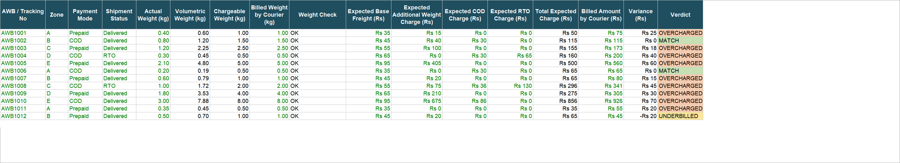

# Excel Automation Templates

Free, no-code Excel/Google Sheets templates for the spreadsheet work that admin, ops, and finance folks
end up doing by hand every month - checking bills, catching overcharges, and making sure the numbers add up.

No coding, no plugins, no sign-ups. Download a template, drop in your own data, and the formulas do the rest.

## Templates

| Template | What it solves |
|---|---|
| [Courier Billing Audit](./courier-billing-audit) | Catches courier/logistics overcharges - wrong zone, wrong weight slab, inflated COD/RTO charges |
| [Payment Gateway TDR Audit](./payment-gateway-tdr-audit) | Catches payment gateway settlement overcharges against your contracted TDR rate card |
| [Volumetric Weight & Box-Fit Checker](./volumetric-weight-box-fit-checker) | Tells you the cheapest box each product actually fits in, and flags products with no good fit |

## Preview

Every template follows the same pattern: a Rate Card/Library tab you customize, a Data tab you paste your
own records into, and an Audit/Fit Checker tab that recalculates automatically and flags what needs
attention. See each template's own README for full screenshots and a worked example.

## How to use any template

1. Open the template folder and download the `.xlsx` file.
2. Open it in Excel or upload it to Google Sheets.
3. Every workbook has a **Read Me** tab first - follow its steps.
4. Replace the sample data (blue text, yellow-shaded cells) with your own numbers.
5. The audit/summary tabs recalculate automatically - no formulas to write yourself.

## Use cases

- **Reconciliation** - check courier bills and payment gateway settlements before you pay/accept them, not after.
- **Vendor negotiation** - a documented pattern of overcharges is real leverage when renegotiating contracts or rates.
- **Onboarding new vendors** - validate a new courier's or gateway's first month of billing against the agreed contract.
- **Packaging/warehouse planning** - avoid oversized boxes and packing-table surprises before a product launches.
- **Portfolio/consulting proof** - hand a prospective employer or client a working template instead of just describing the skill.

Each template's own README has a more detailed use-case list for that specific workflow.

## Why these exist

Built out of real operational work auditing courier billing and payment settlements for an e-commerce
brand - turned into generic templates anyone can reuse, with all company-specific data stripped out and
replaced with illustrative sample numbers.

## License

MIT - use, modify, and share freely.
