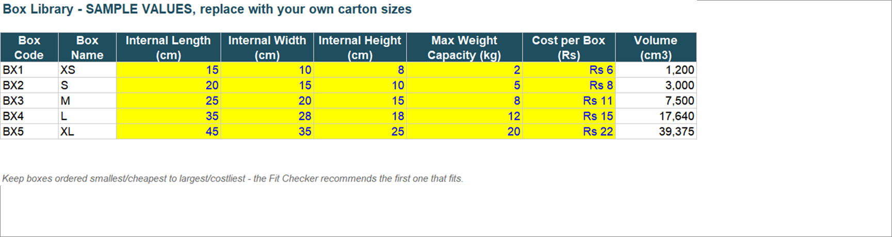
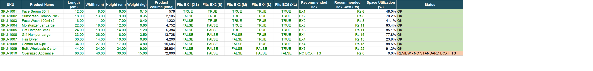
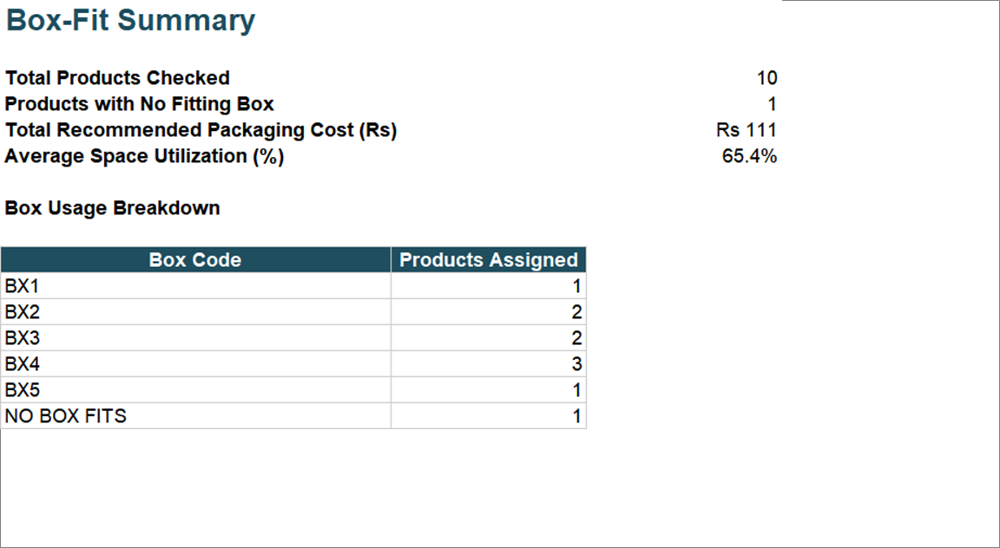

# Volumetric Weight & Box-Fit Checker

**The problem:** Couriers charge by volumetric weight, not just actual weight - so shipping a product in a
box that's bigger than it needs to be can quietly inflate every shipping bill. And packing teams often
figure out a product doesn't fit its usual box only after it's already been picked.

**What this template does:** You give it your standard box sizes and your product dimensions. It tells you
the cheapest box each product actually fits in, and flags any product that doesn't fit any box you stock -
before it becomes a packing-table problem or an oversized shipping bill.

## File

[`Volumetric_Weight_Box_Fit_Checker.xlsx`](./Volumetric_Weight_Box_Fit_Checker.xlsx)

## What it looks like

**Box Library** - your carton sizes, costs, and weight limits:

**Fit Checker** - every product matched to its cheapest fitting box, or flagged if none fit:

**Summary** - packaging cost total and box usage breakdown:

## Tabs in the workbook

1. **Read Me** - quick instructions.
2. **Box Library** - your standard carton sizes, max weight capacity, and cost per box. Sample values
   included - replace with your own packaging.
3. **Product Data** - paste your own product dimensions and weights here.
4. **Fit Checker** - checks each product against every box and recommends the cheapest one that fits, or
   flags "NO BOX FITS" if none do.
5. **Summary** - how many products need review, total recommended packaging cost, and box usage breakdown.

## Important: how to enter dimensions

For **every product and every box**, enter:
- **Length** = the longest side
- **Width** = the middle side
- **Height** = the shortest side

This keeps the fit-check accurate no matter which way something is actually oriented. Also keep the Box
Library ordered from smallest/cheapest to largest/costliest - the checker recommends the first box that
fits, which only works out to the cheapest option if the sizes are in ascending order.

## Step-by-step walkthrough (worked example)

The template ships pre-loaded with 5 sample boxes and 10 sample products so you can see it work before
touching your own data. Here's what happens end to end, using product **SKU-1004 "Moisturizer Jar Large"**
as the example:

1. **Set up your box library first.** Open the Box Library tab. It's pre-loaded with 5 boxes from XS to XL,
   ordered smallest/cheapest to largest/costliest - e.g. BX3 ("M") is 25 x 20 x 15 cm, holds up to 8 kg, and
   costs Rs 11. Replace these with your own carton sizes, keeping them in ascending order.

2. **Drop in your product data.** On the Product Data tab, SKU-1004 is entered as Length 22 cm, Width 18 cm,
   Height 12 cm, Weight 0.60 kg - longest side first, as instructed. This is exactly how you'd enter your
   own product catalog.

3. **The Fit Checker tab does the work automatically.** For SKU-1004, it checks every box in order:
   - BX1 (15x10x8)? No - 22 cm is longer than 15 cm.
   - BX2 (20x15x10)? No - 22 cm is longer than 20 cm.
   - BX3 (25x20x15)? **Yes** - 22≤25, 18≤20, 12≤15, and 0.60 kg is under the 8 kg limit.
   - It stops at the first fit (since boxes are ordered cheapest-first), recommending **BX3 at Rs 11**, and
     calculates space utilization = product volume (4,752 cm³) / box volume (7,500 cm³) = **63.4%**.

4. **Products with no fit get flagged.** SKU-1010 "Oversized Appliance" (60x40x30 cm) is too big for even
   BX5 (the largest box), so it shows **"NO BOX FITS"** and a **"REVIEW - NO STANDARD BOX FITS"** status -
   your signal to either source a custom box or ship it via a different method.

5. **Read the totals off the Summary tab.** For the sample data: 10 products checked, 1 needs review,
   **Rs 111 total recommended packaging cost**, and a breakdown of how many products land in each box size.

6. **Swap in your real data** on the Box Library and Product Data tabs (delete the sample rows first), and
   the Fit Checker and Summary tabs recalculate instantly - no formulas to touch.

## Before you use it

Replace the 5 sample box sizes (XS to XL) and their costs with your actual packaging options, and swap in
your real product catalog on the Product Data tab.

The Fit Checker and Summary formulas are pre-built for up to 200 products - paste in fewer or more rows and
the totals adjust automatically, no formulas to touch. If you have more than 200 products, select the last
row of the Fit Checker tab and drag-fill it down as far as you need.

## Use cases

- **New product launch** - check packaging fit before a SKU goes live, instead of discovering it doesn't fit
  at the packing table.
- **Packaging cost optimization** - find products shipping in oversized boxes and quietly inflating
  volumetric weight charges.
- **Warehouse SOP** - give packers a definitive "which box for which SKU" reference instead of guesswork.
- **Vendor/box-supplier planning** - estimate packaging spend before committing to a box size lineup.
